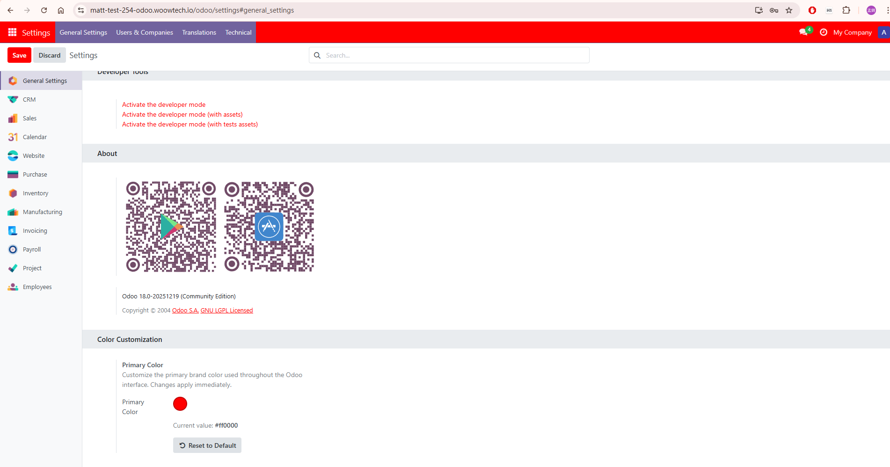
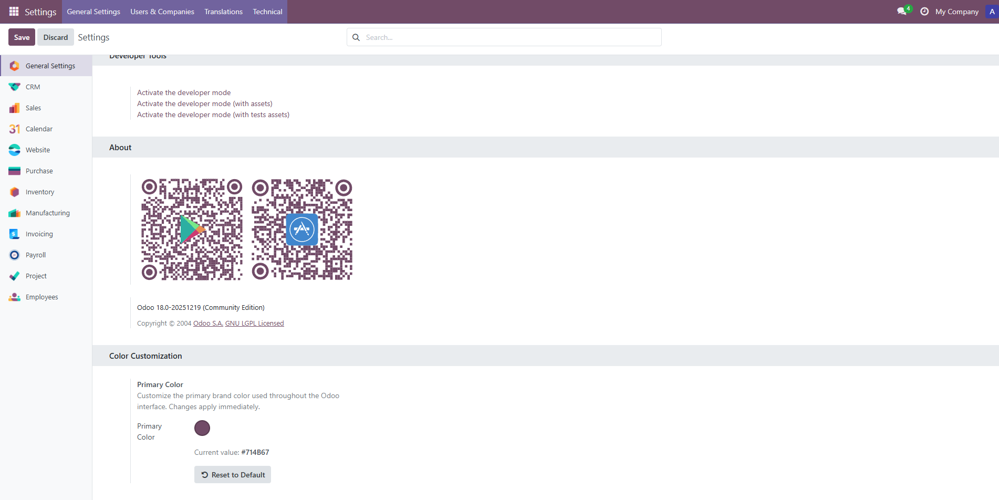
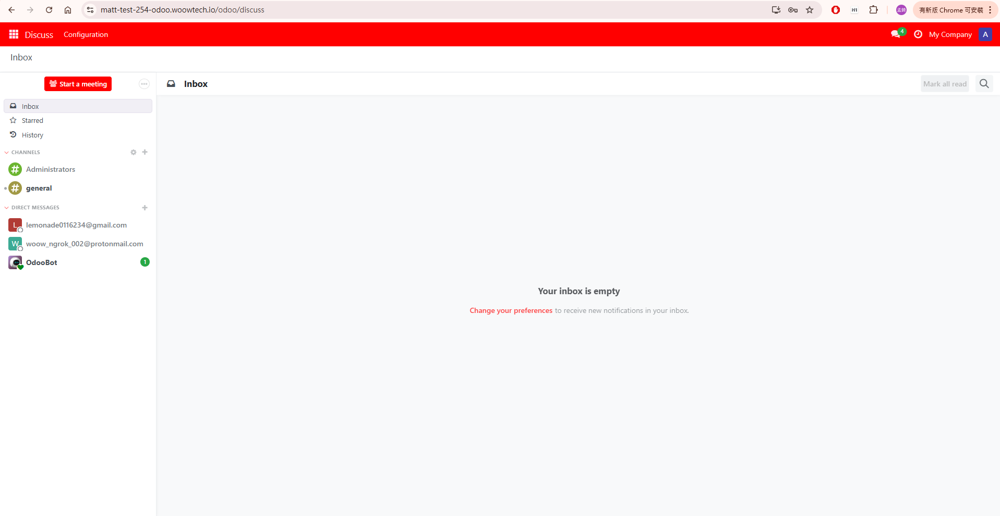
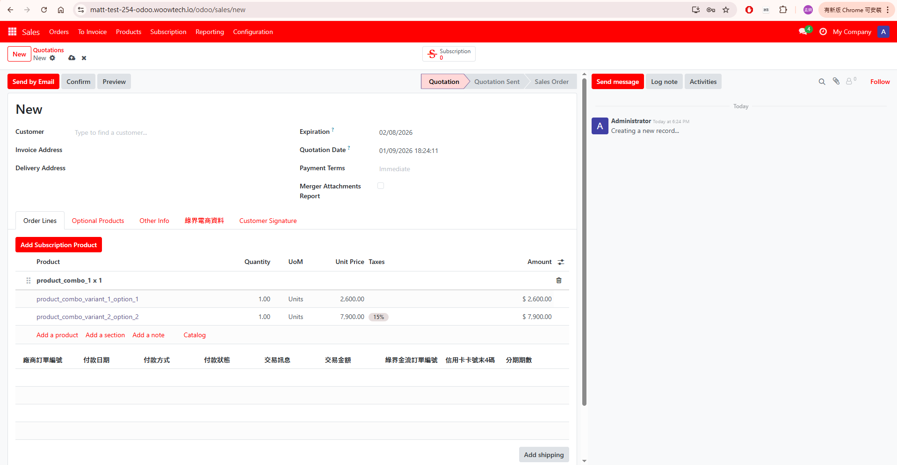
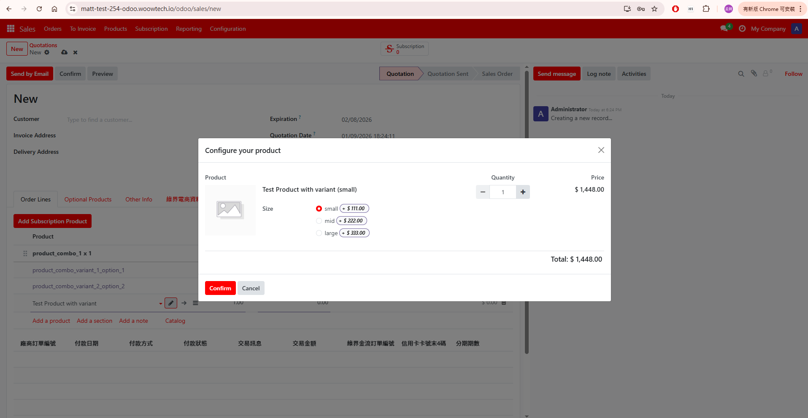
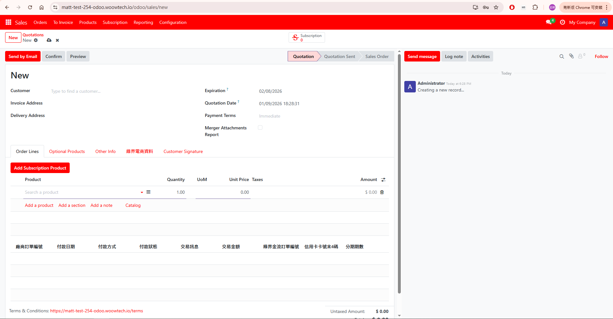
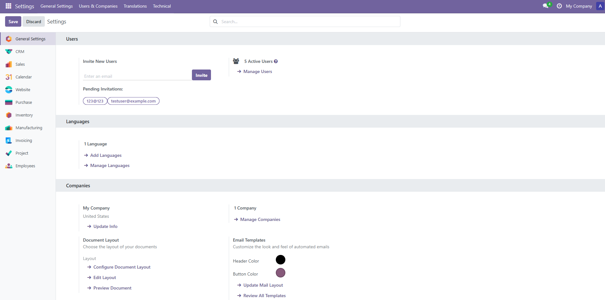
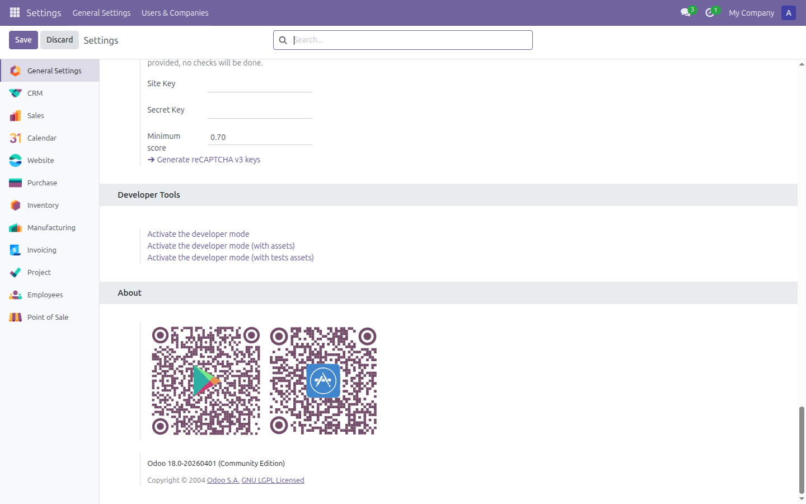

<p align="center">
  
</p>

<h1 align="center">Odoo Color Customizer</h1>

<p align="center">
  <strong>One-Click Brand Color Customization for Odoo 18</strong><br/>
  Change the entire Odoo interface color from a single settings panel — no code, no CSS, no page reload
</p>

<p align="center">
  <a href="#features">Features</a> &bull;
  <a href="#architecture">Architecture</a> &bull;
  <a href="#installation">Installation</a> &bull;
  <a href="#screenshots">Screenshots</a> &bull;
  <a href="#configuration">Configuration</a> &bull;
  <a href="#css-custom-properties">CSS Properties</a> &bull;
  <a href="#javascript-api">JS API</a> &bull;
  <a href="#troubleshooting">Troubleshooting</a> &bull;
  <a href="README_zh-TW.md">中文文件</a>
</p>

<p align="center">
  
  
  
  
  
</p>

---

## Overview

**Odoo Color Customizer** is a lightweight, production-ready Odoo 18 module that enables system administrators to customize the primary brand color used across the entire Odoo interface — navbar, buttons, links, forms, badges, calendars, status bars, and 30+ UI components — all from a simple color picker in General Settings.

<p align="center">
  
</p>

### Why This Module?

| Challenge | Solution |
|-----------|----------|
| Odoo's default purple doesn't match your brand | Pick any color — interface updates instantly |
| CSS modifications require developer skills | Zero-code color picker in General Settings |
| Color changes break on Odoo upgrades | Dynamic CSS generation — upgrade-safe |
| Need different branding per environment | Change colors without touching source code |
| Frontend and backend need consistent branding | Covers both backend and frontend layouts |
| Portal users shouldn't see custom colors | Portal users automatically retain Odoo's default styling |

---

## Features

### Core Capabilities

- **Color Picker in Settings** — Native Odoo color widget integrated into General Settings
- **Live Preview** — See color changes instantly without page reload using CSS custom properties
- **Persistent Storage** — Color saved to `ir.config_parameter`, survives restarts and upgrades
- **Reset to Default** — One-click reset to Odoo Community's default purple (`#71639e`)
- **Automatic Text Contrast** — WCAG-compliant luminance calculation for white/black text selection
- **Cache-Busting** — Color value in CSS URL ensures browsers always load the latest theme

### Comprehensive UI Coverage (30+ Elements)

- **Navigation bar** — Background color, dropdowns, active items
- **Primary buttons** — Normal, hover, active, disabled states
- **Outline & link buttons** — Border and text color matching
- **Form inputs** — Focus border colors, checkboxes, radio buttons
- **List views** — Row selection highlight, hover states
- **Kanban cards** — Card accents and progress indicators
- **Calendar events** — Event background colors
- **Status bars** — Active step indicators
- **Badges** — Primary badge styling
- **Tabs & pills** — Active tab indicators
- **Dropdown menus** — Active item highlighting
- **Search facets** — Filter tag colors
- **Pagination** — Active page indicators
- **Progress bars** — Fill color
- **Discuss sidebar** — Category highlights
- **Frontend editor** — Launcher button styling
- **Product configurator** — Selection indicators
- **And more...** — 34+ bug fixes for comprehensive coverage

### Smart User Handling

- **Internal Users** — See the custom brand color throughout the interface
- **Portal Users** — Automatically retain Odoo's original default styling (no custom CSS injected)

---

## Architecture

```
┌─────────────────────────────────────────────────────────────────┐
│                    Odoo Color Customizer Module                  │
├─────────────────────────────────────────────────────────────────┤
│                                                                  │
│  ┌──────────────────────┐  ┌─────────────────────────────────┐  │
│  │   Settings UI        │  │   JavaScript Service            │  │
│  │                      │  │                                 │  │
│  │ • Color Picker       │  │ • Live Preview Engine           │  │
│  │ • Current Value      │  │ • Theme CSS Loader              │  │
│  │ • Reset to Default   │  │ • Color Utility Functions       │  │
│  │                      │  │ • window.ColorCustomizer API    │  │
│  └──────────┬───────────┘  └──────────┬──────────────────────┘  │
│             │                         │                          │
│             ▼                         ▼                          │
│  ┌──────────────────────────────────────────────────────────┐   │
│  │              Settings Model (res.config.settings)         │   │
│  │                                                           │   │
│  │  primary_color field ──► ir.config_parameter storage      │   │
│  │  Default: #71639e (Odoo Community purple)                 │   │
│  └──────────────────────────┬────────────────────────────────┘   │
│                              │                                    │
│  ┌──────────────────────────▼────────────────────────────────┐   │
│  │              CSS Controller (HTTP Endpoints)               │   │
│  │                                                            │   │
│  │  GET /color_customizer/theme.css                           │   │
│  │  ├── Read primary_color from ir.config_parameter           │   │
│  │  ├── Calculate color variants (hover, active, light)       │   │
│  │  ├── Calculate contrast text color (WCAG luminance)        │   │
│  │  └── Return dynamic CSS with 30+ UI element overrides      │   │
│  │                                                            │   │
│  │  GET /color_customizer/frontend.css                        │   │
│  │  ├── Frontend-specific CSS (website pages)                 │   │
│  │  └── Mobile hamburger menu & editor launcher fixes         │   │
│  └────────────────────────────────────────────────────────────┘   │
│                              │                                    │
│  ┌──────────────────────────▼────────────────────────────────┐   │
│  │              SCSS Overrides (web.assets_backend)            │   │
│  │                                                            │   │
│  │  877 lines of CSS custom property rules                    │   │
│  │  var(--custom-primary), var(--custom-primary-hover), ...   │   │
│  └────────────────────────────────────────────────────────────┘   │
│                                                                   │
├───────────────────────────────────────────────────────────────────┤
│                         Odoo 18 Framework                         │
│  base_setup │ web │ ir.config_parameter │ res.config.settings     │
└───────────────────────────────────────────────────────────────────┘
```

### Module File Structure

```
odoo_color_customizer/
├── __init__.py
├── __manifest__.py                     # Module metadata (v18.0.1.4.0)
├── controllers/
│   ├── __init__.py
│   └── main.py                         # Dynamic CSS endpoints (866 lines)
│                                       #   GET /color_customizer/theme.css
│                                       #   GET /color_customizer/frontend.css
│                                       #   Color calculation helpers
├── models/
│   ├── __init__.py
│   └── res_config_settings.py          # Settings model with color field
├── views/
│   ├── res_config_settings_views.xml   # Settings UI (color picker + reset)
│   └── web_templates.xml               # Frontend CSS injection template
├── security/
│   └── ir.model.access.csv            # Access control
└── static/src/
    ├── js/
    │   └── color_customizer.js         # Live preview & theme loading (234 lines)
    └── scss/
        ├── color_overrides.scss        # CSS variable overrides (877 lines)
        └── frontend_minimal.scss       # Frontend page styling
```

### How It Works — Data Flow

```
User picks color (#FF0000)
        │
        ▼
┌─────────────────┐    JavaScript updates CSS custom
│  Color Picker    │───► properties instantly (live preview)
│  in Settings     │
└────────┬────────┘
         │ Save
         ▼
┌─────────────────────┐
│  ir.config_parameter │    Stored as: odoo_color_customizer.primary_color
│  (persistent store)  │
└────────┬────────────┘
         │ On page load
         ▼
┌─────────────────────────────┐
│  CSS Controller generates:   │
│                              │
│  --custom-primary: #FF0000   │    Main color
│  --custom-primary-hover:     │    Darkened 10%
│  --custom-primary-active:    │    Darkened 20%
│  --custom-primary-light:     │    Lightened 85%
│  --custom-primary-text:      │    White (auto-calculated)
└────────┬────────────────────┘
         │
         ▼
┌─────────────────────────────┐
│  SCSS rules apply variables  │    30+ UI elements updated
│  to all Odoo UI components   │    via CSS custom properties
└─────────────────────────────┘
```

---

## Screenshots

### Color Settings — Custom Red Theme

Color picker in General Settings with red (#ff0000) applied. The entire Odoo navbar, buttons, and UI elements update immediately.

<p align="center">
  
</p>

### Color Settings — Default Purple Restored

One-click "Reset to Default" restores Odoo's original purple (#714B67).

<p align="center">
  
</p>

### Discuss — Red Theme Applied

The Discuss module with custom red theme showing consistent navbar and button styling.

<p align="center">
  
</p>

### Sales — Form View with Custom Color

Sales order form showing red theme applied to navbar, primary buttons ("Send by Email", "Send message"), status bar tabs, and action links.

<p align="center">
  
</p>

### Sales — Product Configurator Dialog

Product configurator modal showing custom color on radio buttons, "Confirm" button, and selection borders.

<p align="center">
  
</p>

### Sales — New Order with Custom Theme

New sales quotation form demonstrating comprehensive color coverage: tabs ("Order Lines", "Optional Products"), action links, and form elements.

<p align="center">
  
</p>

### Default Odoo — Without Module Installed

Standard Odoo 18 Community with default purple theme. This is how Odoo looks before installing the Color Customizer module.

<p align="center">
  
</p>

### Default Odoo — Settings Navbar (Before)

Standard Odoo 18 settings page showing default purple navbar for comparison.

<p align="center">
  
</p>

---

## Installation

### Prerequisites

- **Odoo 18.0** (Community or Enterprise)
- **Python 3.10+**
- No additional Python packages required
- No additional system dependencies

### Step 1: Clone the Repository

```bash
git clone https://github.com/WOOWTECH/odoo_color_customizer.git
```

### Step 2: Deploy the Module

```bash
# Copy the module to your Odoo addons path
cp -r odoo_color_customizer/odoo_color_customizer /path/to/odoo/addons/

# Or add the repo root to your addons path in odoo.conf
# addons_path = /path/to/odoo/addons,/path/to/odoo_color_customizer
```

### Step 3: Install in Odoo

1. Go to **Apps** menu
2. Click **Update Apps List**
3. Search for **"Color Customizer"**
4. Click **Activate**

> **Tip:** If the module doesn't appear, enable Developer Mode first, then remove the "Apps" filter in the search bar.

---

## Configuration

### Setting the Brand Color

1. Navigate to **Settings > General Settings**
2. Scroll to the **Color Customization** section (bottom of page)
3. Click the color picker circle to choose your brand color
4. The UI updates immediately for preview
5. Click **Save** to persist the change

### Resetting to Default

Click the **Reset to Default** button to restore Odoo's default purple (`#71639e`).

### Configuration Parameter

The color is stored in `ir.config_parameter`:

| Key | Default | Description |
|-----|---------|-------------|
| `odoo_color_customizer.primary_color` | `#71639e` | Primary brand color (hex format) |

---

## CSS Custom Properties

The module generates five CSS custom properties from your chosen color:

| Property | Calculation | Example (#FF0000) |
|----------|-------------|-------------------|
| `--custom-primary` | User's chosen color | `#FF0000` |
| `--custom-primary-hover` | Darkened by 10% | `#E60000` |
| `--custom-primary-active` | Darkened by 20% | `#CC0000` |
| `--custom-primary-light` | Lightened by 85% | `#FFD9D9` |
| `--custom-primary-text` | White or black (WCAG luminance) | `#FFFFFF` |

### Text Contrast Algorithm

The module calculates text color using the WCAG relative luminance formula:

```
Luminance = 0.2126 * R + 0.7152 * G + 0.0722 * B
Text = luminance > 0.5 ? black : white
```

This ensures readable text on any background color.

### Affected UI Elements

| Category | Elements |
|----------|----------|
| **Navigation** | Navbar background, dropdown toggles, active items |
| **Buttons** | `.btn-primary` (all states), `.btn-outline-primary`, `.btn-link` |
| **Forms** | Focus borders, checkboxes, radio buttons, switches |
| **Lists** | Row selection, hover highlights |
| **Kanban** | Card accents, progress indicators |
| **Calendar** | Event backgrounds, day selection |
| **Status Bar** | Active step buttons |
| **Badges** | `.badge` primary styling |
| **Tabs** | Active tab/pill indicators |
| **Dropdowns** | Active item background |
| **Search** | Facet tag colors |
| **Pagination** | Active page indicator |
| **Progress** | Bar fill color |
| **Discuss** | Sidebar category highlights |
| **Frontend** | Editor launcher, mobile hamburger menu |

---

## JavaScript API

The module exposes a global JavaScript API via `window.ColorCustomizer`:

```javascript
// Live preview — updates CSS variables instantly (client-side only)
window.ColorCustomizer.updateLivePreview('#FF5733');

// Refresh theme CSS from server (after saving settings)
await window.ColorCustomizer.refreshThemeCSS();

// Load theme CSS on startup
await window.ColorCustomizer.loadColorTheme();
```

### Color Utility Functions

```javascript
// Convert hex to RGB
ColorCustomizer.hexToRgb('#FF0000');  // {r: 255, g: 0, b: 0}

// Darken a color by percentage
ColorCustomizer.darkenColor('#FF0000', 0.1);  // '#E60000'

// Lighten a color by percentage
ColorCustomizer.lightenColor('#FF0000', 0.85); // '#FFD9D9'

// Get contrast text color (white or black)
ColorCustomizer.getContrastColor('#FF0000');    // '#FFFFFF'
```

---

## HTTP Endpoints

| Endpoint | Method | Description |
|----------|--------|-------------|
| `/color_customizer/theme.css` | GET | Dynamic backend CSS with all color overrides |
| `/color_customizer/frontend.css` | GET | Dynamic frontend CSS for website pages |

Both endpoints return CSS with `no-cache` headers to ensure real-time updates.

---

## Compatibility

| | |
|---|---|
| **Odoo Version** | 18.0 |
| **Edition** | Community and Enterprise |
| **License** | LGPL-3 |
| **Dependencies** | `base_setup`, `web` (Odoo core modules only) |
| **Website Module** | Optional — works with or without |
| **Python Packages** | None (uses Odoo built-ins only) |

---

## Troubleshooting

### Color Not Applying After Save

The browser may cache the CSS. Try:
1. Hard refresh: `Ctrl+Shift+R` (Windows/Linux) or `Cmd+Shift+R` (Mac)
2. Clear browser cache
3. The module uses cache-busting via color value in URL, so a normal reload should work

### Module Not Appearing in Apps

1. Enable Developer Mode: **Settings > Developer Tools > Activate the developer mode**
2. Go to **Apps** and remove the "Apps" filter in the search bar
3. Search for "color_customizer" or "Color Customizer"

### Color Picker Not Showing in Settings

1. Ensure the module is installed (check **Apps > Installed**)
2. The Color Customization section is at the **bottom** of General Settings — scroll down past "Developer Tools" and "About"

### Frontend Pages Not Updating

1. Frontend CSS uses a separate endpoint (`/color_customizer/frontend.css`)
2. The template only injects CSS for **internal users** (group_user)
3. Portal users intentionally see the default Odoo styling

---

## Changelog

### v18.0.1.4.0 (2026-04)

- **Fix:** Portal users now maintain Odoo's original default styling — custom CSS is not injected for portal/external users
- **Fix:** Frontend editor launcher triangle color fix
- **Fix:** Mobile hamburger menu icon styling
- **Fix:** "All Applications" button text visibility
- **Improvement:** 34+ bug fixes for comprehensive UI element coverage
- **Improvement:** Removed website module dependency — works independently

### v18.0.1.0.0 (2026-01)

- **Initial Release:** Color picker in General Settings
- **Feature:** Live preview via CSS custom properties
- **Feature:** Dynamic CSS generation with color variants
- **Feature:** Reset to default functionality
- **Feature:** Comprehensive SCSS overrides for 30+ UI elements

---

## Support

- **Issues:** [GitHub Issues](https://github.com/WOOWTECH/odoo_color_customizer/issues)
- **Email:** gt.apps.odoo@gmail.com

---

## License

This module is licensed under the **GNU Lesser General Public License v3 (LGPL-3)**.

See [LICENSE](https://www.gnu.org/licenses/lgpl-3.0.html) for details.

---

<p align="center">
  <sub>Built with care by <a href="https://github.com/WOOWTECH">WOOWTECH</a> &bull; Powered by Odoo 18</sub>
</p>
